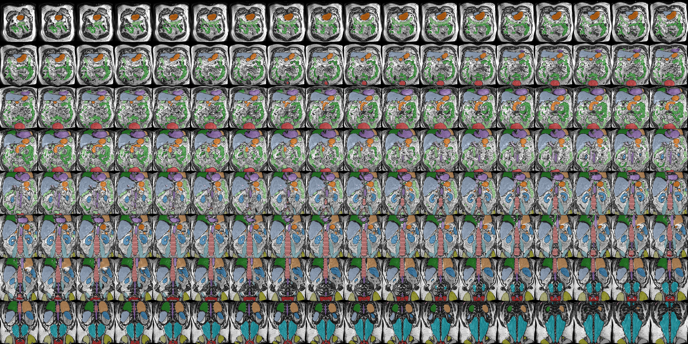

# totseg: Total segmentation of iBEAt Dixon data

---
## 🛠️ Requirements

What you need to run the scripts in this pipeline:

- Python installation
- Miniconda installation
- Download of this repository

Conda is the software that creates python environments, but you will need to initialise it before you can use it. Miniconda comes with a simple app to help you with this. Search for *Anaconda Prompt* among your apps, open it, and type: 

```bash
conda init powershell
```

You only need to do this once after installing miniconda.

## 💻 Installation

These instructions show how to install the required python software environment. You only need tp do this once, or after major upgrades of the pipeline itself.

**Notes**

- These instructions are for Windows but they are very similar on Mac or Linux. 
- If you encounter errors running any of these scripts this is likely because of software installation issues. In that case copy-paste the error messages in a large language model and follow the instructions to resolve.

To start, open a terminal (in Windows use PowerShell) and go to the folder with the download of this repository (adapt this with your folder path):

```bash
cd C:\Users\MyUserName\Documents\GitHub\ppln-ibeat-totseg
```

To install the python environment you need to be connected to the internet. First, remove any previous installation (this is not necessary if this is the first time you are doing this). Deactivate any existing environment:

```bash
conda deactivate
```

Then remove totseg:

```bash
conda env remove -n totseg
```

Now reinstall the environment again:

```bash
conda env create -f env.yml
```

This could take a while, and you should see constant progress messages in your terminal. If it finishes successfully, conda will tell you so, and end with an instruction on how to activate the environment:

```bash
conda activate -n totseg
```

## 📂 Data organisation

The analysis assumes your data are in a folder called **iBEAt_Build**. Within that, there should be a subfolder **dixon** with cleaned iBEAt Dixon data (provided by *miblab*). This folder is read-only. The data it contains will not be modified by the analysis. All results will appear in a second folder called **totseg** under **iBEAt_Build**.

**Note**: It is good practice, though not required, to keep data and sofware in separate folders. Do not include data in a software folder or vice versa.

## 🚀 Starting a new session

Assuming the software environment is installed, you are now ready to start analysing the data. You can pause this anytime, close the PowerShell, and come back to it later to start a new session. 

To start a new session, open a terminal (On Windows use PowerShell) and go to the folder where you downloaded this repository (adapt with your path):

```bash
cd C:\Users\MyUserName\Documents\GitHub\ppln-ibeat-totseg
```

Then activate the environment:

```bash
conda activate totseg
```

For convenience, define a data variable to point to the *iBEAt_Build* database, so you don't have to type the full path every time. Make sure to change this path so it points to *your* location of the data:

```bash
$data = "C:\Users\MyUserName\Documents\Data\iBEAt_Build"
```

**Note** This data variable is used in all further commands to avoid that you have to type the full path every time. So this variable needs to be created every time you start a new session.

**Note**: In all subsequent steps, you can use Ctrl+C to interrupt any calculation anytime, but be aware this may corrupt the data you are writing. After a forced interruption it is best to manually delete the folder you were writing before running the script again.

---

## 👁️‍🗨️ Stage 1: Autosegmentation with TotalSegmentator

This has already been done - no need to run again.

---
## 📸 Stage 2: Build mosaic displays of autosegmented organs



This will create images with mosaic displays of autogenerated masks of any or all organs on top of the out-phase dixon. Results will be saved in a folder called **stage_2_display**. 

This will show masks for ALL organs:

```bash
python -m totseg.stage_2_display --build=$data
```

You can also show one particular organ only, e.g the aorta:

```bash
python -m totseg.stage_2_display --build=$data --organs aorta
```

Or you can show multiple organs by listing them with spaces in between:

```bash
python -m totseg.stage_2_display --build=$data --organs aorta liver pancreas
```

**Note (1)**: The naming of the organs follows the conventions from [TotalSegmentator](https://github.com/wasserth/totalsegmentator), classes **total_mr** and **tissue_types_mr**. 

**Note (2)**: You can interrupt this computation at any time (hit Ctrl + C) and resume it later. This will *not* cause any data corruption and when you restart the existing results will *not* be recomputed. If you *do* want to recompute them, manually delete the folder with results first.

---
## 📐Stage 3: Measure autosegmented organs

This will compute radiomics shape metrics for any or all of the organs, and save them in csv format. This does not need step 2 to be completed, but it is wise to visually check the masks before running computations and extracting measurements. Results will be saved in a folder called **stage_3_measure**.

Fastest is to export results for a single organ only:

```bash
python -m totseg.stage_3_measure --build=$data --organs aorta
```

To do this for multiple organs, separate them with spaces:

```bash
python -m totseg.stage_3_measure --build=$data --organs aorta liver
```

It can also be done for all organs available, but beware this can take a long time to compute. You will see a progress bar during the computation. 

```bash
python -m totseg.stage_3_measure --build=$data
```

**Note** You can interrupt this computation at any time (hit Ctrl + C) and resume it later. This will *not* cause any data corruption and when you restart, the existing results will *not* be recomputed. If you *do* want to recompute them, manually delete the folder with results first.

**Note** This will produce the standard pyradiomics 3D shape metrics, and a few additional custom shape metrics computed with skimage. For background and definitions of the pyradiomics features, please refer to the [pyradiomics documentation](https://pyradiomics.readthedocs.io/en/latest/features.html#module-radiomics.shape).


---
## 🎨 Stage 4: Edit autosegmented masks

This stage is interactive and will allow you to edit autosegmented masks with a graphical user interface. Results will be saved in a folder called **stage_4_edit**.

**Important**: You will be fed a continuous stream of images to edit, and it is likely too much work to do in a single session. You can interrupt this (Ctrl + C) and continue later, but **DO NOT INTERRUPT DURING LOADING OR SAVING DATA** as this may corrupt your results. Instead, wait for the graphical user interface to pop up. The program is now waiting for you to do start editing, so at this time you can safely interrupt by hitting Ctrl + C. The next time you run this, it will simply skip the data that are already saved.

In this step, you *must* specify an organ to edit:

```bash
python -m totseg.stage_4_edit --build=$data --organ aorta
```

By default this is editing in the coronal plane. To edit in the axial plane instead, provide the *plane* argument:

```bash
python -m totseg.stage_4_edit --build=$data --organ aorta --plane axial
```

Or sagittal:

```bash
python -m totseg.stage_4_edit --build=$data --organ aorta --plane sagittal
```

---
## 📸 Stage 5: Build mosaic displays of edited organs

After editing some or all of your masks, you can build mosaic displays of the edited organs. Results will be saved in a folder called **stage_5_display**. This is similar to building mosaics in step 2, except that this will pick up edited rather than autosegmented organs.

Builds mosaics for all available edited organs:

```bash
python -m totseg.stage_5_display --build=$data
```

Build mosaic displays of aorta (or any other organ) alone:

```bash
python -m totseg.stage_5_display --build=$data --organs aorta
```

Or multiple organs:

```bash
python -m totseg.stage_5_display --build=$data --organs aorta liver pancreas
```

**Note**: if any of the organs you asked for are not there, this will silently be skipped. It will not cause an error.

---
## 📐 Stage 6: Measure edited organs

This again is similar to the measuring step in stage 3, except that this will work on edited organs rather than autosegmented. The results are saved in folder **stage_6_measure**:

Measure a single organ:

```bash
python -m totseg.stage_6_measure --build=$data --organs aorta
```

Measure multiple organs:

```bash
python -m totseg.stage_6_measure --build=$data --organs aorta liver
```

Measure all organs (THIS TAKES A LONG TIME!!!):

```bash
python -m totseg.stage_6_measure --build=$data
```
